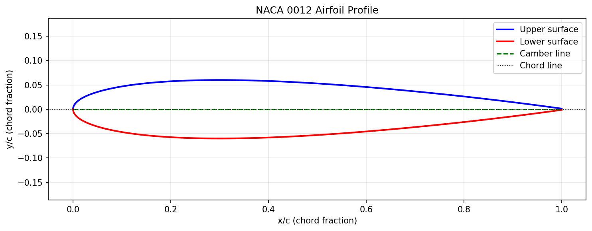
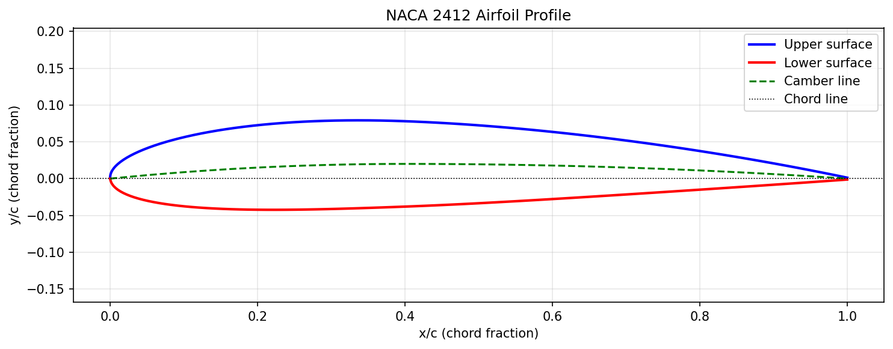
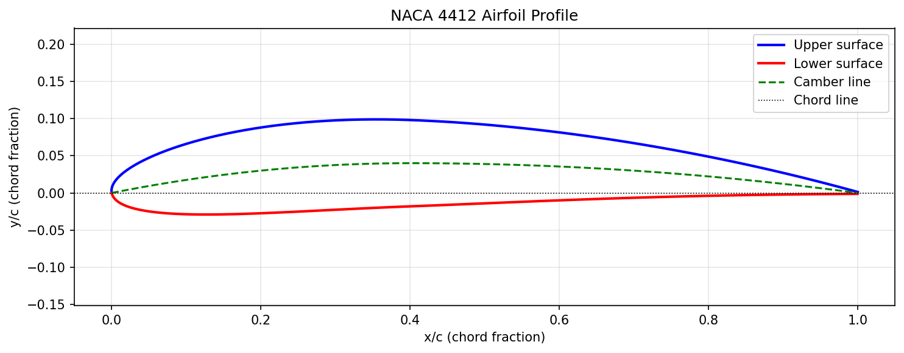

# Project 3 - NACA Airfoil Plotter

**Status: Complete**  
**Tool: Python - NumPy, Matplotlib**  
**Author: Manya Tiwari | Aerospace Engineering Year 2 | KIIT University**

## What this project does
Generates and plots the complete profile of any NACA 
4-digit airfoil from the number alone. Computes upper 
surface, lower surface, and camber line using the 
standard NACA thickness and camber equations.

## What the four digits mean
For NACA 2412:
- **2** - maximum camber is 2% of chord length
- **4** - maximum camber located at 40% of chord
- **12** - maximum thickness is 12% of chord length

NACA 0012 has zero camber - perfectly symmetric airfoil.

## How it works
1. Extracts camber (m), camber position (p), 
   and thickness (t) from the 4-digit number
2. Creates x coordinates using cosine spacing - 
   more points near leading edge for accuracy
3. Computes thickness distribution using the 
   NACA 1933 formula
4. Computes camber line - two equations for 
   front and rear sections
5. Combines thickness and camber to get upper 
   and lower surface coordinates
6. Plots and saves as PNG

## Airfoils generated

### NACA 0012 - Symmetric


Zero camber - upper and lower surfaces are mirror images.
Used for vertical tail fins, helicopter rotors, and CFD benchmarking.

### NACA 2412 - Lightly cambered


2% camber at 40% chord - classic general aviation airfoil.
Used on Cessna 172 and many light aircraft wings.

### NACA 4412 - More cambered


4% camber at 40% chord - higher lift at low speeds.
Used on high-lift wings and UAV designs.

## Results
| Airfoil | Max Camber | Camber Position | Max Thickness | Type |
|---------|-----------|-----------------|---------------|------|
| NACA 0012 | 0% | - | 12% | Symmetric |
| NACA 2412 | 2% | 40% chord | 12% | Cambered |
| NACA 4412 | 4% | 40% chord | 12% | Cambered |

## Key concepts demonstrated
- NACA thickness formula: uses sqrt(x) for rounded 
  leading edge, polynomial terms for trailing edge taper
- Cosine spacing: clusters points near leading edge 
  for accurate curvature representation
- Perpendicular thickness: thickness measured normal 
  to camber line using sin/cos rotation
- np.where for piecewise functions: camber line uses 
  different equations front and rear

## Connection to aerospace engineering
NACA airfoils are the foundation of all wing design. 
The Hindustan-228 at HAL Kanpur uses a supercritical 
wing - a modern evolution of the same NACA principles. 
This script generates the same profiles used in 
real aircraft design and CFD analysis.

## Next step
NACA 0012 coordinates from this script will be used 
as input geometry for Project 4 - CFD airfoil analysis 
in ANSYS (planned for July 2026).

## How to use
```python
# Plot any NACA 4-digit airfoil
plot_airfoil('0012')  # symmetric
plot_airfoil('2412')  # cambered
plot_airfoil('6412')  # high camber
```

## Files
- `naca_airfoil.py` - main script
- `naca_0012.png` - symmetric airfoil plot
- `naca_2412.png` - cambered airfoil plot  
- `naca_4412.png` - high camber airfoil plot

## Skills used
Python · NumPy · Matplotlib · Trigonometry ·  
Aerospace aerodynamics · NACA airfoil theory
